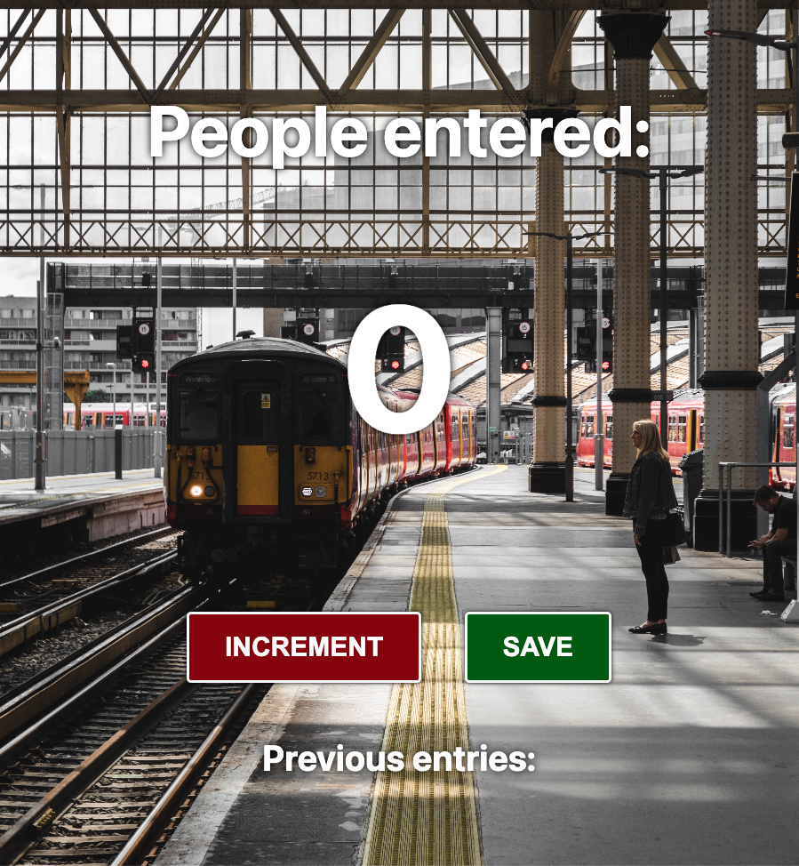

# Build a Passenger Counter App

### This basic static project uses HTML/CSS and JavaScript languages to create a simple passenger counter
to determine how many people are boarding the trains.  It has the functionality of incrementing and then 
saving that number before starting another count.

https://jacksondynamics.github.io/PassengerCounter/
